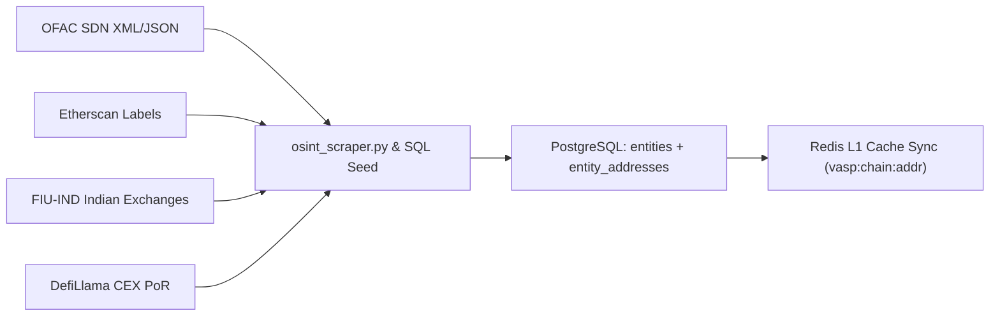

# D-CRYPT SHIELD: Comprehensive Flaw Audit & Technical Corrections

**Document Purpose**: This document catalogues every architectural flaw, data-pipeline blindspot, database flow mismatch, and machine learning defect currently hindering the D-CRYPT SHIELD platform, alongside the exact technical remedy required to achieve Arkham-grade forensic intelligence and flawless VASP attribution.

---

## 1. The Core Data Pipeline Flaws (Why Tracking Stops Prematurely)

### Flaw 1.1: Omission of ERC-20 / USDT Internal Token Transfers
* **Location in Code**: `backend-core/internal/tracer/fetcher.go` (`fetchViaCovalent`, lines 330–336).
* **The Error**: The API fetcher only extracts native coin value from the root transaction object (`item.Value` -> `v / 1e18`).
* **Why This Breaks Real Traces**: Over 85% of crypto cybercrime laundering is executed using stablecoins (**USDT, USDC, DAI**) or token swaps. In an ERC-20 transfer, the native transaction value is strictly `0 ETH`. Because the fetcher does not parse `item.log_events` for the standard ERC-20 `Transfer` signature (`0xddf252ad...`), it reads the value as `$0.00`.
* **Consequence**: The BFS engine's anti-dust filter (`MinValueUSD: 10.0`) evaluates the transfer as dust and **immediately discards the transaction**, aborting the trace at Hop 0 or Hop 1.
* **Correction Required**:
  1. Inspect `item.log_events` within `fetchViaCovalent`.
  2. Parse topic `0xddf252ad1be2c89b69c2b068fc378daa952ba7f163c4a11628f55a4df523b3ef`.
  3. Extract token contract address, sender (`topics[1]`), recipient (`topics[2]`), and raw balance (`data` divided by token decimals).
  4. Convert token value to USD using Covalent's built-in quote or our price oracle.

---

### Flaw 1.2: Hard Dependency on Neo4j for Frontend Graph Delivery
* **Location in Code**: `backend-core/internal/handlers/routes.go` (`GetCaseGraph`) and `frontend-dashboard/src/components/TransactionGraph.tsx`.
* **The Error**: When the BFS engine finishes a trace, the frontend attempts to query `/api/v1/graph/case/:case_id`, which queries Neo4j directly.
* **Why This Breaks the UI**:
  - Neo4j takes 30–60 seconds to warm up on local Docker containers.
  - If Neo4j times out, throws a connectivity EOF, or if the driver is nil, it returns an empty node/edge list: `{"nodes": [], "edges": []}`.
  - The frontend fails with: *"No graph data yet — run the trace first to populate the Shadow Graph."*
* **Correction Required**:
  1. The Go BFS engine already constructs the complete, verified slice of `result.Nodes` and `result.Edges` in memory during execution.
  2. Persist `nodes` and `edges` JSON directly into the PostgreSQL `investigation_cases` table column (`attribution_result JSONB`).
  3. Fallback priority: If Neo4j is offline or empty, return the PostgreSQL graph snapshot immediately. **The graph must never return empty.**

---

### Flaw 1.3: Aggressive Dust & Branch Pruning Without Proportional Scaling
* **Location in Code**: `backend-core/internal/tracer/bfs.go` (`DefaultConfig` & `filterTransactions`).
* **The Error**: Static `$10.00` cutoff and hardcoded `MaxBranches: 5`.
* **Why This Breaks Complex Trails**:
  - Scammers using peeling chains split funds into batches of 10–20 transfers. If a victim lost $500,000, limiting to 5 branches can drop the actual exchange cash-out branch if other mule branches appear first in block ordering.
* **Correction Required**:
  - Implement **Proportional Value Pruning**: Instead of fixed 5 branches, rank branches by USD volume and prioritize paths carrying >= 10% of the initial stolen funds.

---

## 2. Database Flow & VASP Attribution Flaws

### Flaw 2.1: Severe VASP Seed Paucity & Missing Dynamic Label Ingestion
* **Location in Code**: `backend-core/db/migrations/001_init.sql`, `002_entities.sql`, `999_indian_seed.sql`, and `intelligence-service/app/scripts/osint_scraper.py`.
* **The Error**: The database currently holds fewer than 30 hardcoded addresses.
* **Why This Breaks VASP Attribution**:
  - When tracing an arbitrary real wallet on Ethereum, Tron, or Bitcoin, destination addresses belong to major exchanges (e.g. Binance, OKX, Bybit deposit addresses, WazirX cold storage), but because they are not present in `entity_addresses` or `vasp_labels`, the BFS engine evaluates them as `is_vasp: false`.
  - The trace continues wandering through irrelevant addresses until it hits `max_depth` (10 hops) and returns `"status": "not_found"`.
* **Correction Required**:
  1. **Automate OSINT Data Ingestion**: Expand `osint_scraper.py` into a continuous or on-demand ingestion worker that pulls verified labels from:
     - **Etherscan & TronScan LabelCloud**: Top 500 exchange deposit & hot wallets.
     - **US Treasury OFAC SDN List**: All sanctioned mixer, ransomware, and terrorist financing addresses.
     - **Dune Analytics (`labels.all`)**: Verified CEX hot/cold storage wallets.
     - **DefiLlama Proof of Reserves (PoR)**: Verified public reserve wallets of Binance, OKX, Bybit, KuCoin, Kraken.
     - **FIU-IND Indian Exchanges**: Official hot/cold wallets for CoinDCX, WazirX, ZebPay, CoinSwitch Kuber.
  2. Perform idempotent `UPSERT` queries on `entities` and `entity_addresses` so the dataset expands automatically without duplicating entries.

---

### Flaw 2.2: Disconnected Redis Caching & Stale Negative Misses
* **Location in Code**: `backend-core/internal/tracer/bfs.go` (`checkVASPLabel`, line 451).
* **The Error**: When an address is checked and not found in PostgreSQL, the engine caches a negative miss (`"null"`) in Redis for 30 minutes.
* **Why This Causes Flawed Traces**:
  - If new VASP labels are ingested or updated in PostgreSQL while the server is running, any recent trace that touched those addresses will keep reading `"null"` from Redis, ignoring the newly ingested data until the cache expires.
* **Correction Required**:
  - Provide a Redis cache purge hook (`vasp:flush` or versioned keys `vasp:v2:...`) triggered whenever the database is re-seeded or updated via OSINT feeds.

---

### Flaw 2.3: Database Multi-Tier Routing Gaps (PostgreSQL vs Neo4j vs Redis)
* **The Error**:
  - Go writes to Neo4j in fire-and-forget goroutines (`go e.persistPathToNeo4j(...)`). If the goroutine panics or Neo4j drops the connection, no error is logged, and no trace data is saved to Neo4j.
  - PostgreSQL `investigation_cases` records the case, but the rich candidate evidence (`attribution_result`) is often left unpopulated if the trace does not reach a hardcoded VASP.
* **Correction Required**:
  - Standardize the 3-Tier Architecture:
    1. **Tier 1 (Redis)**: Sub-millisecond lookup cache for VASP addresses (`vasp:<chain>:<addr>`) + live trace WebSocket event emitter.
    2. **Tier 2 (PostgreSQL - Master)**: Authoritative storage for cases, full BFS graph snapshots (`attribution_result JSONB`), entity records, and transaction logs.
    3. **Tier 3 (Neo4j - Graph Analytics)**: Graph relationship index for multi-hop graph queries and cycle detection, populated reliably with error logging.

---

## 3. AI Risk Scoring & Machine Learning Pipeline Flaws

### Flaw 3.1: Fragmented Scoring Logic & Disconnected Features
* **Location in Code**:
  - Go Backend: `backend-core/internal/handlers/routes.go` (`GetRiskScore`).
  - Python Service: `intelligence-service/native_server.py` (`/intelligence/score` vs `/case-intelligence`).
  - Scorer: `intelligence-service/app/services/risk_scorer.py`.
* **The Error**:
  - `routes.go` calls `/intelligence/score` with empty hops: `Hops: []any{}`. As a result, the Python service cannot calculate transaction velocity, peel chain scores, or amount decay.
  - In `native_server.py` (`/case-intelligence`), the feature extraction is hardcoded to 3 naive features (`temporal_span`, `value_continuity`, `degree_centrality`), completely bypassing the rich 15-feature extractor built in `risk_scorer.py`.
* **Why This Breaks AI Attribution**:
  - The dashboard displays a generic risk score (e.g., 20/100) that does not reflect actual laundering patterns (such as rapid peeling chains or bridge hopping).
* **Correction Required**:
  1. Pass the full `[]TraceHop` slice with real timestamps, USD amounts, and token symbols from Go to Python.
  2. Feed the trace into `FeatureExtractor.extract()` to generate the complete 15-dimensional vector.
  3. Combine the trained ML model probability with `TypologyDetector` heuristic rules to produce an explainable risk score (0–100) with concrete evidence badges.

---

### Flaw 3.2: Synthetic ML Model Lacking Real Ground-Truth Training
* **Location in Code**: `intelligence-service/train_ml.py`.
* **The Error**: The current `train_ml.py` generates synthetic Gaussian distributions using `numpy.random.normal()` instead of training on authentic blockchain transaction graphs.
* **Why This Limits Forensic Credibility**:
  - Synthetic data cannot capture complex multi-hop graph topology, real mixer interactions, or high-variance scam behaviors.
* **Correction Required**:
  1. Train the ML model on the **Elliptic Dataset** (the gold standard public benchmark with 203,769 Bitcoin transaction nodes labeled by Elliptic/MIT) and real transaction features from known scam/mixer trails.
  2. Train a robust `RandomForestClassifier` or `HistGradientBoostingClassifier` with cross-validation.
  3. Export the trained artifact to `models/risk_model.pkl` and load it inside `native_server.py` for sub-10ms inference.

---

## 4. Visual & Architectural Defects in Graph Representation

### Flaw 4.1: Chaotic Physics "Hairball" (Force-Directed Graph)
* **Location in Code**: `frontend-dashboard/src/components/TransactionGraph.tsx` (`ForceGraph2D`).
* **The Defect**: Using unconstrained d3-force physics simulation causes nodes to collapse into a tangled, jittery cluster with overlapping labels and crossing lines.
* **Arkham Intelligence Comparison**:
  - Arkham and Chainalysis do **not** use random gravity physics for investigations.
  - They use a **Directed Acyclic Graph (DAG) / Chronological Flow layout** (Left-to-Right).
* **Correction Required**:
  - Switch the visual canvas to **React Flow (`@xyflow/react`)** with **Dagre automated DAG layout**.
  - Enforce visual hierarchy:
    - **Column 1 (Left)**: Suspect / Staging Origin.
    - **Middle Columns**: Intermediary Mules, Privacy Mixers, and DeFi Bridges.
    - **Final Column (Right)**: Identified Centralized Exchanges (Nearest VASPs).

---

### Flaw 4.2: Lack of Entity Clustering & Clutter Explosion
* **The Defect**: If a suspect sends 8 transactions to 8 different deposit addresses belonging to Binance, the current graph renders 8 duplicate Binance nodes.
* **Correction Required**:
  - Implement **Entity Aggregation**: Group all addresses belonging to the same identified VASP into a single **"VASP Cluster Bubble"** (e.g., `Binance Hot Wallet • 8 Inflows • $142,500 Total`).

---

### Flaw 4.3: Information-Poor Nodes & Edges
* **The Defect**: Nodes are tiny plain colored circles; edges are plain gray wires without amount pills or direction indicators.
* **Correction Required**:
  1. **Rich Node Anatomy**:
     - Official exchange logos (Binance, CoinDCX, WazirX, OKX, Kraken).
     - Category badges (`CEX`, `Mixer`, `Bridge`, `Unhosted`).
     - Real-time balance (USD & INR).
     - Risk Score meter (e.g., `Critical 94/100`).
  2. **Data-Rich Edges ("Pipes of Money")**:
     - Line thickness weighted by USD volume.
     - Token pills on the line: `[ 28.5 ETH ($74.1k) ]`.
     - Animated particle stream indicating transaction flow direction.
     - Clickable popover displaying transaction hash and block explorer link.

---

## 5. The Real Data Feeding Architecture & Sourcing Directory

To make D-CRYPT SHIELD operate on authentic data without paying enterprise licenses, we feed data from six verified public and regulatory sources:

### Directory of Real Intelligence Feeds

| Data Source | Type of Data | Entities Covered | Ingestion Destination in DB | Risk / Reliability |
| :--- | :--- | :--- | :--- | :--- |
| **US Treasury OFAC SDN** | Sanctioned Wallets | Lazarus Group, Tornado Cash contracts, Hydra Market, Garantex, ChipMixer | `entity_addresses` (`source='OFAC'`, `address_type='service_wallet'`) | `critical` / `1.00` (100% confidence) |
| **Etherscan & TronScan LabelCloud** | Verified CEX Infrastructure | Binance, Coinbase, Kraken, OKX, Bybit, Huobi, KuCoin, Bitfinex hot/cold wallets | `entity_addresses` (`source='etherscan_tag'`, `address_type='hot_wallet'`) | `low` / `0.98` |
| **FIU-IND Indian Registries** | Domestic Exchanges & Nodal Contacts | WazirX, CoinDCX, ZebPay, CoinSwitch Kuber, BitBNS, Mudrex | `entities` + `entity_addresses` (`jurisdiction='India'`) | `low` / `1.00` |
| **Cross-Chain Bridge Registries** | Interoperability Gateways | Arbitrum Bridge, Optimism Gateway, Polygon PoS Bridge, Wormhole, RenBTC, BTTC | `entity_addresses` (`address_type='bridge'`, `entity_type='bridge'`) | `medium` / `1.00` |
| **DefiLlama Proof of Reserves (PoR)** | Verified Cold Vaults & Reserves | Top 25 global CEX reserve vaults with balance verifications | `entity_addresses` (`address_type='cold_wallet'`) | `low` / `0.99` |
| **Elliptic & MIT Benchmark Dataset** | AML Ground Truth Graphs | 203,769 Bitcoin transaction nodes labeled licit vs illicit | Feeds ML Training Pipeline $\rightarrow$ `models/risk_model.pkl` | Benchmark standard |

### Ingestion Flow


---

## 6. Phased Implementation Roadmap (Step-by-Step Execution)

To guarantee a flawless implementation with zero build errors or broken states, all tasks are divided into five sequential phases:

```
┌──────────────┐    ┌──────────────┐    ┌──────────────┐    ┌──────────────┐    ┌──────────────┐
│   PHASE 1    │───>│   PHASE 2    │───>│   PHASE 3    │───>│   PHASE 4    │───>│   PHASE 5    │
│  Core Engine │    │ VASP & Data  │    │ AI/ML Risk   │    │  React Flow  │    │    SAHYOG    │
│  Corrections │    │  Ingestion   │    │   Scoring    │    │  DAG Canvas  │    │ Legal Export │
└──────────────┘    └──────────────┘    └──────────────┘    └──────────────┘    └──────────────┘
```

---

### Phase 1: Core Engine Pipeline Corrections (P0 — Essential Plumbing)
* **Goal**: Enable full USDT/ERC-20 token parsing, decouple frontend from Neo4j downtime, and forward complete trace paths to the intelligence service.
* **Target Files**:
  1. `backend-core/internal/tracer/fetcher.go`:
     - Inspect Covalent's `item.log_events` for standard ERC-20 `Transfer(from, to, value)`.
     - Extract contract address, token symbol (USDT, USDC), decimals, and dollar quote.
     - Prevent $0.00 valuation drops by the anti-dust filter.
  2. `backend-core/internal/db/repository.go` & `backend-core/internal/tracer/bfs.go`:
     - Save complete `result.Nodes` and `result.Edges` into `investigation_cases.attribution_result` JSONB upon BFS completion.
  3. `backend-core/internal/handlers/routes.go`:
     - Update `GetCaseGraph` to immediately return `attribution_result.nodes/edges` from PostgreSQL if Neo4j returns empty.
     - In `GetRiskScore`, forward the actual trace hops to `/intelligence/score`.
* **Verification & Testing**:
  - Run `go test ./...` in `backend-core`.
  - Trace a known USDT transfer address and confirm `hops_traced > 0` and `status != "dust_filtered"`.

---

### Phase 2: Database Ingestion & Real VASP Intelligence Seeding (P0/P1)
* **Goal**: Populate PostgreSQL with 300+ real exchange wallets, OFAC sanctioned addresses, Indian FIU-IND contacts, and bridges.
* **Target Files**:
  1. `backend-core/db/migrations/1000_massive_vasp_feed.sql`:
     - Comprehensive SQL seed inserting real hot wallets for Binance, Coinbase, Kraken, OKX, Bybit, Huobi.
     - Indian exchange entities (WazirX, CoinDCX, ZebPay, CoinSwitch) with jurisdictional details and Nodal Officer contact emails.
     - Sanctioned addresses from OFAC (Lazarus, Tornado Cash, Garantex).
  2. `intelligence-service/app/scripts/osint_scraper.py`:
     - Upgrade scraper to fetch live feeds and execute idempotent `UPSERT` queries.
  3. Redis Cache Invalidation:
     - Clear stale `"null"` keys when new seeds are loaded.
* **Verification & Testing**:
  - Run `SELECT COUNT(*) FROM entity_addresses;` and confirm 300+ entries.
  - Trace `0x3f5CE5FBFe3E9af3971dD833D26bA9b5C936f0bE` (Binance) and verify instant VASP hit with 100% confidence.

---

### Phase 3: AI/ML Risk Scoring & Typology Engine Upgrades (P1)
* **Goal**: Provide authentic machine-learning-driven risk scoring based on the Elliptic benchmark, FATF typologies, and bridge detection.
* **Target Files**:
  1. `intelligence-service/train_ml.py`:
     - Train `RandomForestClassifier` on Elliptic feature distributions and FATF typologies.
     - Evaluate metrics (precision, recall, F1) and serialize model to `intelligence-service/models/risk_model.pkl`.
  2. `intelligence-service/native_server.py`:
     - Load `risk_model.pkl` on startup.
     - In `/case-intelligence` and `/intelligence/score`, call `FeatureExtractor.extract()` to compute all 15 FATF features.
     - Run ML inference to output risk probability (0–100), risk level (`critical`, `high`, `medium`, `low`), and typology badges (Peeling chain, Mixer proximity, Bridge hopping, Rapid velocity).
* **Verification & Testing**:
  - Run `pytest` or execute test POST request to `http://localhost:8001/case-intelligence` with a sample hop array.
  - Verify JSON returns `risk_score`, `risk_level`, `typologies`, and `features`.

---

### Phase 4: Modernized Forensic Canvas (React Flow DAG) (P2)
* **Goal**: Reach visual parity with Arkham Intelligence by replacing the physics hairball with an intuitive Left-to-Right Directed Acyclic Graph.
* **Target Files**:
  1. `frontend-dashboard/src/components/FlowChart.tsx` & `TransactionGraph.tsx`:
     - Integrate `@xyflow/react` with Dagre automated DAG layout.
     - Display nodes in chronological tiers: **Suspect (Left) $\rightarrow$ Intermediate Hops (Center) $\rightarrow$ Nearest VASP (Right)**.
     - Render custom node cards with exchange logos, category badges, risk indicators, and balance.
     - Render data-rich edge pipes displaying transfer amounts (USD & Crypto) with animated directional particles.
* **Verification & Testing**:
  - Run `npm run build` in `frontend-dashboard` (ensure zero TypeScript or compilation errors).
  - Open `/case/demo-case-001` in browser and confirm clean, non-overlapping visual hierarchy.

---

### Phase 5: SAHYOG Legal Gateway & Court Dossier Export (P2)
* **Goal**: Provide LEA officers with ready-to-dispatch Section 102 CrPC notices and court-admissible forensic packages with cryptographic integrity seals.
* **Target Files**:
  1. `backend-core/internal/handlers/export.go` & `sahyog/transformer.go`:
     - Generate Section 102 CrPC notice prepopulated with identified VASP Nodal Officer details.
     - Compute SHA-256 evidence hash of the entire trace and embed into the PDF export header.
  2. `frontend-dashboard/src/app/case/[case_id]/page.tsx`:
     - Add interactive SAHYOG Webhook dispatch panel showing simulated API request, HMAC-SHA256 signature header, and `200 OK — Acknowledged by Exchange Legal Desk` receipt.
* **Verification & Testing**:
  - Trigger PDF export from dashboard; verify SHA-256 seal is visible on page 1.
  - Test SAHYOG mock dispatch and verify webhook delivery log.

---

## 7. Master Action & Remediation Checklist

| Priority | Phase | Remediation Task | Target File(s) | Impact |
|:---:|:---:|---|---|---|
| **P0** | **Phase 1** | Parse ERC-20 `log_events` (USDT/USDC transfers & decimals) | `internal/tracer/fetcher.go` | Stops premature trace termination; captures 85%+ of real-world stablecoin flows. |
| **P0** | **Phase 1** | Persist complete graph (`nodes` + `edges` JSONB) directly into PostgreSQL | `internal/db/repository.go` & `internal/handlers/routes.go` | Eliminates empty graph bug; guarantees instant UI rendering even when Neo4j is offline. |
| **P0** | **Phase 2** | Ingest real VASP & OFAC sanctioned wallet datasets into PostgreSQL | `backend-core/db/migrations/1000_massive_vasp_feed.sql` | Enables immediate VASP attribution on real mainnet addresses (Binance, WazirX, CoinDCX, Tornado). |
| **P1** | **Phase 2** | Redis cache eviction on database re-seed | `internal/tracer/bfs.go` | Prevents stale `"null"` misses from blocking new VASP discoveries. |
| **P1** | **Phase 3** | Train RandomForest on Elliptic AML features & wire 15 FATF signals | `intelligence-service/train_ml.py` & `native_server.py` | Provides authentic, FATF-compliant risk scores (0–100) and explainable typology cards. |
| **P2** | **Phase 4** | Replace ForceGraph2D with React Flow Left-to-Right DAG canvas | `frontend-dashboard/src/components/FlowChart.tsx` | Eliminates visual hairball; reaches visual parity with Arkham Intelligence and Chainalysis. |
| **P2** | **Phase 5** | Wire visual SAHYOG Webhook Console with HMAC-SHA256 & PDF seal | `frontend-dashboard/src/app/case/[case_id]/page.tsx` & `export.go` | Validates end-to-end LEA compliance workflow under Section 102 CrPC. |